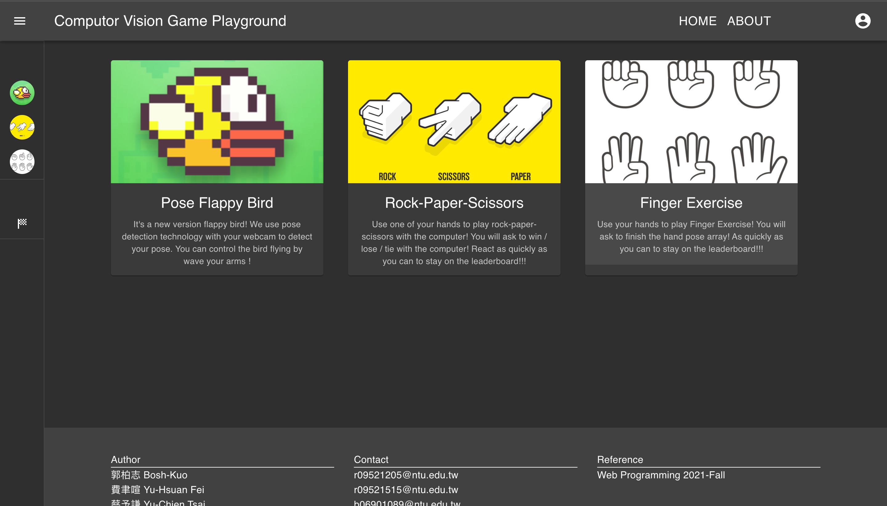
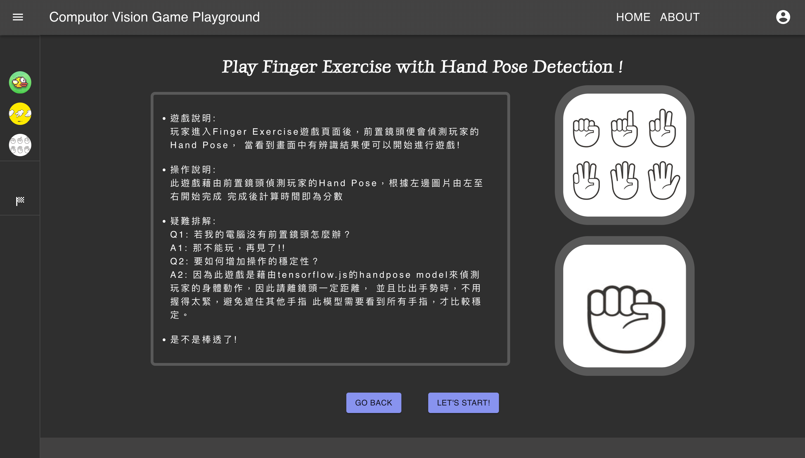
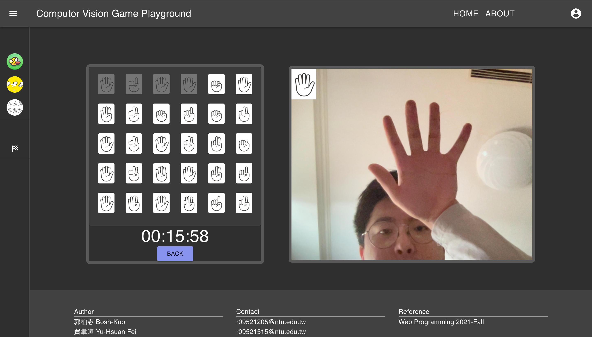

# Computer Vision Playground

Computer vision playground 是一個小遊戲集合，使用 TensorFlow.js 與 MediaPipe 提供已訓練完成的深度學習模型，設計三種利用攝影機進行遊玩的遊戲，並且可以進行登入來記錄在計分板上與人比較。

Team: @Bosh-Kuo, @b06901089





## Installation

- Clone this repo first

- Install frontend & backend packages

```
# in './cvplayground'
cd frontend && yarn
cd backend && yarn
or
# in './cvplayground'
cd frontend && npm inatll
cd backend && npm install
```

## Run in localhost

1. Open two terminal windows
2. Go to './cvplayground/backend' and copy the `.env.defaults` file to `.env` file
3. Fill in the MONGO_URL in the `.env` file with your [MongoDB](https://www.mongodb.com) url and set SALT_ROUNDS

```
#.env
MONGO_URL= (your mongo url)
SALT_ROUNDS= (you can set SALT_ROUNDS=10)
PORT= (your backend port)
```

4. Go to './cvplayground'
5. In one window run this script to start your backend

```
yarn backend
or
npm run start
```

6. In the other window run this script to start your frontend

```
yarn frontend
or
npm start
```

7. Make sure your backend connect to your [MongoDB](https://www.mongodb.com)
8. Open http://localhost:3000 with your browser and you should be able to start plaing our games!

## Reference

- [MediaPipe Hands](https://google.github.io/mediapipe/solutions/hands.html)
- [andypotato/fingerpse](https://github.com/andypotato/fingerpose)
